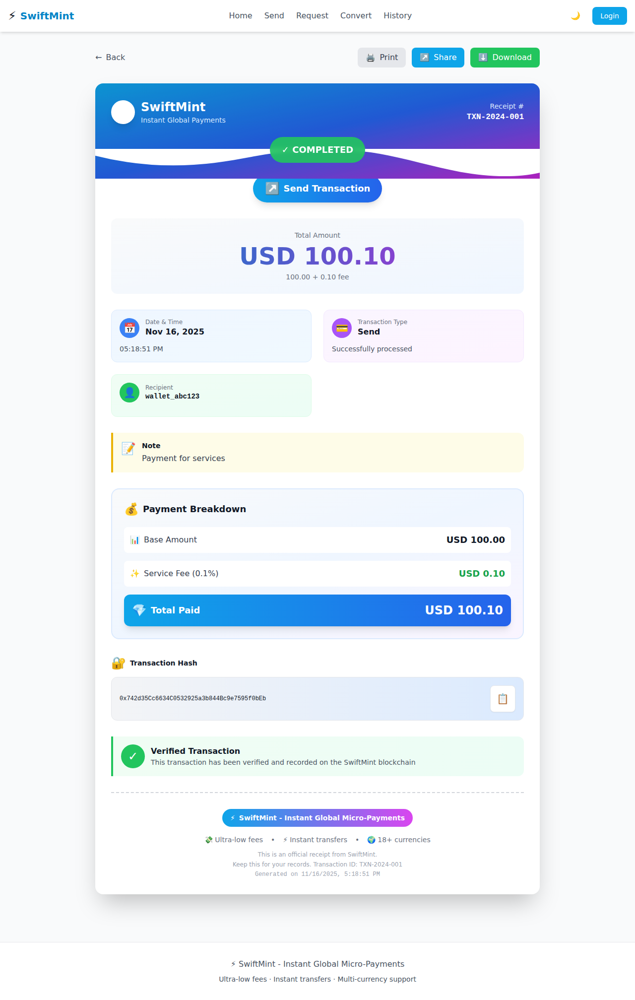
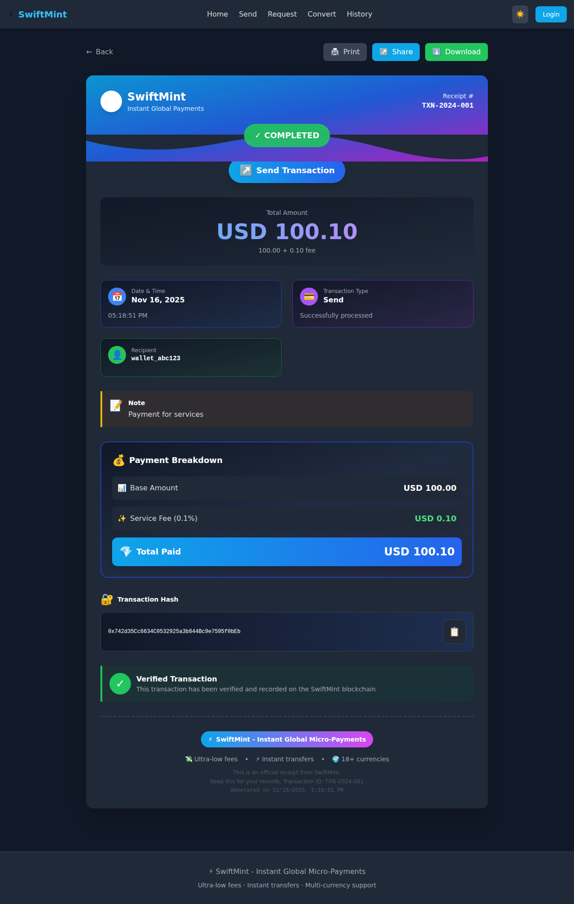

# SwiftMint UI Screenshots

This directory contains screenshots of the SwiftMint application UI demonstrating key features and design elements.

## Receipt Page Screenshots

### Light Mode


**File:** `receipt-page-light-mode.png`  
**Size:** 372 KB  
**Description:** Beautiful receipt design in light mode featuring:
- Gradient header (sky-to-fuchsia) with wave decoration
- Status badge with backdrop blur effect
- Large gradient amount display
- Color-coded info cards (blue, purple, green, orange)
- Payment breakdown section with gradient backgrounds
- Security verification badge
- Transaction hash with copy functionality
- Professional footer with branding
- Download options: PDF, PNG, JSON
- Share buttons: Email, WhatsApp, Twitter, Link

### Dark Mode


**File:** `receipt-page-dark-mode.png`  
**Size:** 447 KB  
**Description:** The same receipt design optimized for dark mode with:
- Dark background with proper contrast
- Adjusted gradient colors for dark theme
- Consistent visual hierarchy
- All interactive elements visible and accessible
- Print-optimized layout

## Design Features

### Color Palette
- **Gradients**: Sky-blue to fuchsia, purple accents
- **Info Cards**: Blue (date), Purple (type), Green (recipient), Orange (sender)
- **Highlights**: Yellow for notes, Green for verification

### Typography
- **Headers**: Bold, large sizes for hierarchy
- **Body Text**: Clear, readable sizes
- **Monospace**: Transaction hashes and IDs

### Layout
- **Responsive**: Mobile-first design
- **Whitespace**: Generous spacing for clarity
- **Cards**: Grouped information in visual cards
- **Borders**: Dashed separator for footer

## Usage

These screenshots can be used for:
- Documentation and README files
- Marketing materials
- Design references
- Bug reports and testing
- Feature demonstrations

## Generating New Screenshots

To capture new screenshots:

1. Start the development server:
```bash
cd frontend
npm run dev
```

2. Navigate to the page you want to capture
3. Use browser dev tools or Playwright to take screenshots
4. Save to this directory with descriptive names

## File Naming Convention

- Use kebab-case for filenames
- Include page name and theme: `{page-name}-{theme}-mode.png`
- Examples:
  - `receipt-page-light-mode.png`
  - `receipt-page-dark-mode.png`
  - `home-dashboard-light-mode.png`
  - `send-money-dark-mode.png`

---

Last updated: November 16, 2025
